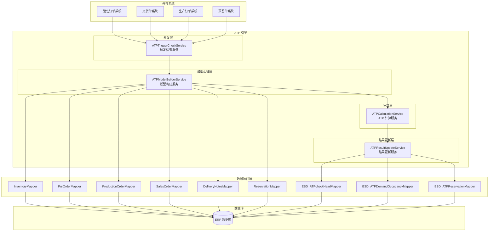
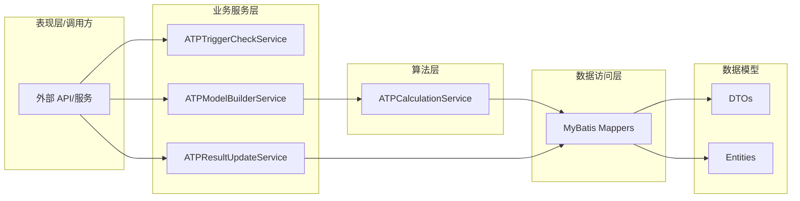
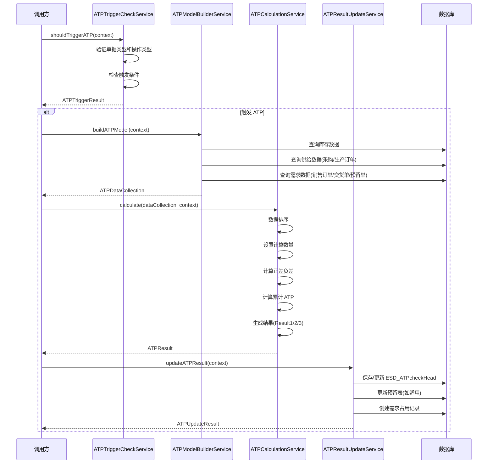

# ATP-PassTest_20260326 模块文档

## 概述

ATP-PassTest_20260326 是一个 **可用量承诺（Available-to-Promise, ATP）计算引擎**，用于 ERP 系统中的库存可用性检查和订单承诺。该模块根据物料的供需数据、库存信息和业务规则，计算在特定日期可承诺给客户的交货数量，并支持多种交货策略。

### 核心功能

- **ATP 触发检查**：根据单据类型和操作类型判断是否触发 ATP 计算
- **ATP 模型构建**：汇总库存、采购订单、生产订单、销售订单、交货单和预留单等供需数据
- **ATP 计算引擎**：支持离散 ATP 和累积 ATP 两种计算模式，提供一次性交货、全部交货和交货建议三种结果类型
- **结果持久化**：将 ATP 计算结果写入数据库，支持事务一致性

### 技术栈

- **语言**：Java 17
- **框架**：Spring Boot, MyBatis
- **构建工具**：Maven/Gradle

---

## 架构概览

### 系统架构图



### 分层架构



---

## 核心业务流程

### ATP 计算完整流程



---

## 子模块说明

本模块包含以下核心子模块，每个子模块有独立的详细文档：

### 1. [ATP 算法引擎](ATP-Algorithm.md)

核心计算引擎，实现 ATP 计算逻辑：
- 数据排序和预处理
- 正差/负差计算
- 累计 ATP 数量计算
- 三种结果类型生成（一次性交货、全部交货、交货建议）
- 工厂日历和补货提前期计算
- 存储地点级别 ATP 计算

### 2. [ATP 服务层](ATP-Services.md)

业务服务层，协调 ATP 计算流程：
- **ATPTriggerCheckService**：判断是否触发 ATP 计算
- **ATPModelBuilderService**：构建 ATP 计算所需的数据模型
- **ATPResultUpdateService**：将计算结果持久化到数据库

### 3. [数据访问层](ATP-DataAccess.md)

MyBatis Mapper 接口，负责数据库操作：
- 库存数据查询
- 供需数据查询（采购订单、生产订单、销售订单、交货单、预留单）
- ATP 结果持久化（检查记录、需求占用、预留更新）

### 4. [数据模型](ATP-DataModels.md)

数据传输对象和实体类：
- 计算上下文和结果 DTO
- 数据库实体类
- 业务异常类

---

## 关键业务规则

### ATP 触发条件

ATP 检查仅在以下**全部条件**满足时触发：

| 条件 | 说明 |
|------|------|
| 需求分类.可用性 = 1 | 需求分类必须启用可用性检查 |
| 计划行类别.可用性 = 1 | 计划行类别必须启用可用性检查 |
| 交货项目.ATPcheckoff 为空 | 未手动关闭 ATP 检查 |

### ATP 时机判断

| 单据类型 | CREATE | MODIFY | DELETE |
|----------|--------|--------|--------|
| 销售订单 (SO) | ✓ 触发 | ✓ 触发 | ✗ 不触发 |
| 外向交货单 (DL) | ✓ 触发 | ✓ 触发 | ✓ 触发 |
| 生产订单 (PO) | ✓ 触发 | ✓ 触发 | ✗ 不触发 |
| 预留单 (RS) | ✓ 触发 | ✓ 触发 | ✓ 触发 |

### MRP 元素映射

| MRP 元素 | 方向 | 说明 |
|----------|------|------|
| 库存 | 1 (供给) | 当前可用库存 |
| PO项目 | 1 (供给) | 采购订单 |
| 生产订单 | 1 (供给) | 生产订单 |
| 订单 | -1 (需求) | 销售订单 |
| 交货单 | -1 (需求) | 外向交货单 |
| 预留单 | ±1 | 预留单（可供给或需求） |

### 检查规则

| 规则 | 结果类型 | 说明 |
|------|----------|------|
| A | Result1 - 一次性交货 | 查找请求日期当天的累计 ATP |
| B | Result2 - 全部交货 | 找到首个累计 ATP >= 请求数量的日期 |
| C | Result3 - 交货建议 | 优先使用正差数量进行分批交货 |
| D/E | A/C + 对话框 | 扩展规则，包含用户交互逻辑 |

### 累计参数

| 参数 | 模式 | 说明 |
|------|------|------|
| 0 | 不累计 | 使用已确认数量 |
| 1 | 累计 | 使用已确认数量 |
| 2 | 创建/修改区分 | 创建时用需求数量，修改时用已确认数量 |
| 3 | 创建/修改区分 | 同参数 2 |

---

## 与其他模块的关系

本模块作为 ERP 系统的核心组件，与以下模块存在依赖关系：

- **销售订单模块**：提供销售订单需求数据，接收 ATP 计算结果
- **采购管理模块**：提供采购订单供给数据
- **生产管理模块**：提供生产订单供给数据
- **库存管理模块**：提供库存数据
- **交货管理模块**：提供外向交货单需求数据
- **预留管理模块**：提供预留单数据

> 注意：具体的模块间依赖关系请参考各模块的独立文档。

---

## 快速开始

### 1. 触发 ATP 检查

```java
ATPTriggerContext context = new ATPTriggerContext();
context.setDocumentType("SO");
context.setOperationType("CREATE");
context.setRequirementClassAvailability(1);
context.setScheduleLineCategoryAvailability(1);
context.setAtpCheckOff(null);

ATPTriggerResult result = triggerCheckService.shouldTriggerATP(context);
if (result.isShouldTrigger()) {
    // 执行 ATP 计算
}
```

### 2. 构建 ATP 模型

```java
ATPModelContext modelContext = new ATPModelContext();
modelContext.setMaterialId("MAT001");
modelContext.setFactoryId(1000L);
modelContext.setBaseDate(20260326L);

ATPDataCollection dataCollection = modelBuilderService.buildATPModel(modelContext);
```

### 3. 执行 ATP 计算

```java
ATPCalculationContext calcContext = new ATPCalculationContext();
calcContext.setCumulativeParameter(1);
calcContext.setCheckRule("A");
calcContext.setBaseDate(20260326L);
calcContext.setRequestDate(20260401L);
calcContext.setRequestQuantity(new BigDecimal("100"));

ATPResult atpResult = calculationService.calculate(dataCollection, calcContext);
```

### 4. 更新 ATP 结果

```java
ATPUpdateContext updateContext = new ATPUpdateContext();
updateContext.setDocumentType("SO");
updateContext.setDocumentNo("SO20260001");
updateContext.setDocumentLineNo("10");
updateContext.setMaterialId("MAT001");
updateContext.setFactoryId(1000L);
updateContext.setConfirmedDate(atpResult.getConfirmedDate());
updateContext.setConfirmedQuantity(atpResult.getConfirmedQuantity());
updateContext.setResultType(atpResult.getResultType());
updateContext.setResultTypeName(atpResult.getResultTypeName());
updateContext.setCheckRule("A");
updateContext.setCumulativeParameter(1);

ATPUpdateResult updateResult = resultUpdateService.updateATPResult(updateContext);
```

---

## 异常处理

模块使用业务异常类进行错误处理，每个异常包含错误码和错误消息：

| 异常类 | 错误码前缀 | 说明 |
|--------|------------|------|
| ATPTriggerException | TC | 触发检查异常 |
| ATPModelBuilderException | MB | 模型构建异常 |
| ATPCalculationException | CA | 计算异常 |
| ATPResultUpdateException | RU | 结果更新异常 |

---

## 文档索引

| 文档 | 说明 |
|------|------|
| [ATP-Algorithm.md](ATP-Algorithm.md) | ATP 算法引擎详细文档 |
| [ATP-Services.md](ATP-Services.md) | ATP 服务层详细文档 |
| [ATP-DataAccess.md](ATP-DataAccess.md) | 数据访问层详细文档 |
| [ATP-DataModels.md](ATP-DataModels.md) | 数据模型详细文档 |
